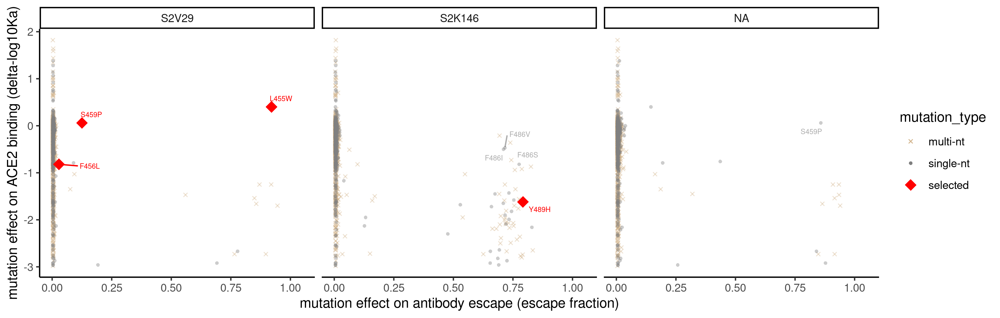

custom analysis plots
================
Tyler Starr
06/02/2023

- <a href="#data-input-and-formatting"
  id="toc-data-input-and-formatting">Data input and formatting</a>
- <a href="#part-1-circulating-variants-at-the-per-mut-level"
  id="toc-part-1-circulating-variants-at-the-per-mut-level">Part 1:
  Circulating variants at the per-mut level</a>
- <a
  href="#part-2-visualizing-selected-viral-escape-mutations-from-orthogonal-experiments"
  id="toc-part-2-visualizing-selected-viral-escape-mutations-from-orthogonal-experiments">Part
  2: Visualizing selected viral escape mutations from orthogonal
  experiments</a>

This notebook does some random analyses on the mAbs panel that vary from
the more constrained global pipeline.

``` r
#list of packages to install/load
packages = c("yaml","data.table","tidyverse","ggrepel","knitr")
#install any packages not already installed
installed_packages <- packages %in% rownames(installed.packages())
if(any(installed_packages == F)){
  install.packages(packages[!installed_packages],
                   lib=c(paste("/uufs/chpc.utah.edu/common/home/",Sys.getenv("USER"),"/RLibs/",Sys.getenv("R_VERSION"),sep="")),
                   repos=c("http://cran.us.r-project.org"))
}
#load packages
invisible(lapply(packages, library, character.only=T))

knitr::opts_chunk$set(echo = T)
knitr::opts_chunk$set(dev.args = list(png = list(type = "cairo")))

#read in config file
config <- read_yaml("./config.yaml")

#make output directory
output_dir <- config$custom_plots_dir
if(!file.exists(output_dir)){
  dir.create(file.path(output_dir))
}
```

Session info for reproducing environment:

``` r
sessionInfo()
```

    ## R version 4.1.3 (2022-03-10)
    ## Platform: x86_64-pc-linux-gnu (64-bit)
    ## Running under: Rocky Linux 8.8 (Green Obsidian)
    ## 
    ## Matrix products: default
    ## BLAS/LAPACK: /uufs/chpc.utah.edu/sys/spack/linux-rocky8-nehalem/gcc-8.5.0/intel-oneapi-mkl-2021.4.0-h43nkmwzvaltaa6ii5l7n6e7ruvjbmnv/mkl/2021.4.0/lib/intel64/libmkl_rt.so.1
    ## 
    ## locale:
    ##  [1] LC_CTYPE=en_US.UTF-8       LC_NUMERIC=C              
    ##  [3] LC_TIME=en_US.UTF-8        LC_COLLATE=en_US.UTF-8    
    ##  [5] LC_MONETARY=en_US.UTF-8    LC_MESSAGES=en_US.UTF-8   
    ##  [7] LC_PAPER=en_US.UTF-8       LC_NAME=C                 
    ##  [9] LC_ADDRESS=C               LC_TELEPHONE=C            
    ## [11] LC_MEASUREMENT=en_US.UTF-8 LC_IDENTIFICATION=C       
    ## 
    ## attached base packages:
    ## [1] stats     graphics  grDevices utils     datasets  methods   base     
    ## 
    ## other attached packages:
    ##  [1] knitr_1.37        ggrepel_0.9.1     forcats_0.5.1     stringr_1.4.0    
    ##  [5] dplyr_1.0.8       purrr_0.3.4       readr_2.1.2       tidyr_1.2.0      
    ##  [9] tibble_3.1.6      ggplot2_3.4.1     tidyverse_1.3.1   data.table_1.14.2
    ## [13] yaml_2.3.5       
    ## 
    ## loaded via a namespace (and not attached):
    ##  [1] tidyselect_1.1.2 xfun_0.30        haven_2.4.3      colorspace_2.0-3
    ##  [5] vctrs_0.5.2      generics_0.1.2   htmltools_0.5.2  utf8_1.2.2      
    ##  [9] rlang_1.0.6      pillar_1.7.0     glue_1.6.2       withr_2.5.0     
    ## [13] DBI_1.1.2        dbplyr_2.1.1     modelr_0.1.8     readxl_1.3.1    
    ## [17] lifecycle_1.0.3  munsell_0.5.0    gtable_0.3.0     cellranger_1.1.0
    ## [21] rvest_1.0.2      evaluate_0.15    tzdb_0.2.0       fastmap_1.1.0   
    ## [25] fansi_1.0.2      broom_0.7.12     Rcpp_1.0.11      backports_1.4.1 
    ## [29] scales_1.2.1     jsonlite_1.8.7   fs_1.5.2         hms_1.1.1       
    ## [33] digest_0.6.29    stringi_1.7.6    grid_4.1.3       cli_3.6.0       
    ## [37] tools_4.1.3      magrittr_2.0.2   crayon_1.5.0     pkgconfig_2.0.3 
    ## [41] ellipsis_0.3.2   xml2_1.3.3       reprex_2.0.1     lubridate_1.8.0 
    ## [45] rstudioapi_0.13  assertthat_0.2.1 rmarkdown_2.13   httr_1.4.7      
    ## [49] R6_2.5.1         compiler_4.1.3

## Data input and formatting

Read in escape fractions, filter for Vir mAbs.

``` r
dt <- data.table(read.csv(file=config$escape_fracs_Omicron_BA2,stringsAsFactors=F))
#all mAbs used in plots
dt <- dt[library=="average", .(selection,condition,site,protein_site,wildtype,mutation,mut_escape_frac_single_mut,site_total_escape_frac_single_mut)]

setnames(dt,"mut_escape_frac_single_mut","mut_escape_frac");setnames(dt,"site_total_escape_frac_single_mut","site_total_escape")

dt[,antibody:=as.character(NA)]
dt[condition=="S2V29_33",antibody:="S2V29"]; dt[condition=="S3L17_51",antibody:="S3L17"]; dt[condition=="S2K146_60",antibody:="S2K146"]  

#set antibody as a factor in order of plotting
dt$antibody <- factor(dt$antibody,levels=c("S2V29","S3L17","S2K146"))

dt <- dt[,.(antibody,protein_site,wildtype,mutation,mut_escape_frac,site_total_escape)]
setnames(dt,"protein_site","site")

dt[,site_max_escape:=max(mut_escape_frac,na.rm=T),by=c("antibody","site")]

#load prior dms data
dms <- data.table(read.csv(file=config$mut_bind_expr,stringsAsFactors=F));dms[,mutation:=NULL];dms <- dms[target=="Omicron_BA2"]
```

## Part 1: Circulating variants at the per-mut level

We read in table reporting circulating mutants. We add new columns to
our data frame indicating the nobs and frequency on GISAID, and the
number of countries in which a mutant has been observed. Then, First,
for each antibody, we plot per-mutation escape fraction versus frequency
(log10), with a ‘pseudo-frequency’ of 0.1x the lowest actual frequency,
to enable log10 plotting)

``` r
#read in table giving mutant counts/frequencies on GISAID
counts <- read.csv(config$gisaid_mutation_counts,stringsAsFactors=F)
#add to scores table
dt[,n_country:=0];dt[,frequency:=0]
for(i in 1:nrow(counts)){
  dt[site==counts[i,"site"] & mutation==counts[i,"mutant"],n_country:=counts[i,"n_countries"]]
  dt[site==counts[i,"site"] & mutation==counts[i,"mutant"],frequency:=counts[i,"frequency"]]
}

#add a 'pseudo-frequency' for visualizaiton of count=0 on log plot (add railroad tracks manually and indicate this is 0).
dt[,pseudo_frequency:=frequency]
dt[frequency==0,pseudo_frequency:=0.1*min(dt[frequency>0,frequency])]

p1 <- ggplot(dt)+aes(x=pseudo_frequency,y=mut_escape_frac)+
  geom_point(shape=16, alpha=0.5, size=2.25)+
  facet_wrap(~antibody,nrow=1)+
  scale_x_continuous(trans="log10")+
  scale_y_continuous(limits=c(0,1.05))+
  theme_classic()+
  xlab('mutant frequency on GISAID (log10 scale)')+
  ylab('mutant escape fraction')+
  geom_text_repel(aes(label=ifelse((mut_escape_frac>0.10925 & frequency>1e-6),as.character(paste(wildtype,site,mutation,sep="")),'')),size=3,color="gray40")
p1
```


``` r
invisible(dev.print(pdf, paste(output_dir,"/circ-mut-scatterplot.pdf",sep="")))
```

## Part 2: Visualizing selected viral escape mutations from orthogonal experiments

``` r
#annotate each mutation if its single nt mutationally accessible from wt BA2
#table has column giving the ba2 spike codon
RBD_sites <- data.table(read.csv(file=config$RBD_sites))

#function to return single nt accessibile codons
get.codon.muts <- function(codon){
  nt <- c("a","c","g","t")
  codon_split <- strsplit(codon,split="")[[1]]
  codon_muts <- vector()
  for(i in nt[nt!=codon_split[1]]){
    codon_muts <- c(codon_muts,seqinr::translate(c(i,codon_split[2:3])))
  }
  for(i in nt[nt!=codon_split[2]]){
    codon_muts <- c(codon_muts,seqinr::translate(c(codon_split[1],i,codon_split[3])))
  }
  for(i in nt[nt!=codon_split[3]]){
    codon_muts <- c(codon_muts,seqinr::translate(c(codon_split[1:2],i)))
  }
  return(codon_muts)
}

dt[,BA2_codon := RBD_sites[site_SARS2==site,codon_SARS2_BA2],by=.(site)]

dt[,singlemut := mutation %in% get.codon.muts(BA2_codon),by=.(site,wildtype,mutation)]

#annotate mutations selected as viral escape selection mutants
dt[,viral_escape := FALSE]
dt[antibody=="S2V29" & ( (site==455 & mutation=="W") | 
                          (site==459 & mutation=="P") | 
                          (site==456 & mutation=="L")),
   viral_escape := TRUE]

dt[antibody=="S3L17" & (site==371 & mutation=="L"),
   viral_escape := TRUE]

dt[antibody=="S2K146" & (site==489 & mutation=="H"),
   viral_escape := TRUE]

#add in ACE2 binding effect of mutation from DMS
dt[,ACE2 := dms[position==site & mutant==mutation,delta_bind],by=c("site","mutation")]

#set color, plot symbol, alpha, symbol size, etc. as a single column based on selection parameters above?
dt[,mutation_type:="single-nt"]
dt[singlemut==F,mutation_type:="multi-nt"]
dt[viral_escape==T,mutation_type:="selected"]
dt[,mutation_type := factor(mutation_type,levels=c("multi-nt","single-nt","selected"))]

dt[,alpha:=0.4]
dt[viral_escape==T,alpha:=1]

dt[,cex:=1]
dt[viral_escape==T,cex:=4]

dt[,col:="#7f7f7f"]
dt[singlemut==F,col:="#D2B48C"]
dt[viral_escape==T,col:="#FF0000"]

p1 <- ggplot(dt %>% arrange(mutation_type))+
  aes(x=mut_escape_frac,y=ACE2, color=mutation_type, size=mutation_type, shape=mutation_type, alpha=alpha)+
  geom_point()+
  scale_shape_manual(values=c("single-nt" = 16, "multi-nt" = 4, "selected" = 18))+
  scale_size_manual(values=c("single-nt" = 1, "multi-nt" = 1, "selected" = 4))+
  scale_color_manual(values=c("single-nt" = "#7f7f7f", "multi-nt" = "#D2B48C", "selected" = "#FF0000"))+
  scale_alpha_identity()+
  facet_wrap(~antibody,nrow=1)+
  scale_x_continuous(limits=c(0,1.05))+
  scale_y_continuous()+
  theme_classic()+
  xlab('mutation effect on antibody escape (escape fraction)')+
  ylab('mutation effect on ACE2 binding (delta-log10Ka)')+
  geom_text_repel(aes(label=ifelse((viral_escape==TRUE),as.character(paste(wildtype,site,mutation,sep="")),'')),size=2,color="red",max.overlaps=5000)+
  geom_text_repel(aes(label=ifelse((viral_escape==FALSE & singlemut==T & mut_escape_frac > 0.5 & ACE2 > -1),as.character(paste(wildtype,site,mutation,sep="")),'')),size=2,color="gray20",max.overlaps=1000)
p1
```



``` r
invisible(dev.print(pdf, paste(output_dir,"/viral-escape-selection-scatterplot.pdf",sep="")))
```
