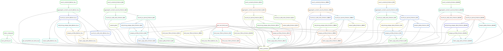

# Summary

 Analysis run by [Snakefile](../../Snakefile)
 using [this config file](../../config.yaml).
 See the [README in the top directory](../../README.md)
 for details.

 Here is the rule graph of the computational workflow:
 

 Here is the Markdown output of each notebook in the workflow:

 1. Get prior RBD DMS mutation-level binding and expression measurements and barcode-variant lookup table from the [SARS-CoV-2-RBD_DMS_Omicron repository](https://github.com/tstarrlab/SARS-CoV-2-RBD_DMS_Omicron-XBB-BQ) and the original DMS library for SARS-CoV-2 (PCR-based mutagenesis) [here](https://github.com/jbloomlab/SARS-CoV-2-RBD_DMS). 

 2. Count variants and then aggregate counts for
    [Wuhan_Hu_1](aggregate_variant_counts_Wuhan_Hu_1.md), 
    [Omicron_BA2](aggregate_variant_counts_Omicron_BA2.md),
    [Omicron_BQ11](aggregate_variant_counts_Omicron_BQ11.md), and
    [Omicron_XBB15](aggregate_variant_counts_Omicron_XBB15.md)
    to create variant counts files for [Wuhan_Hu_1](../counts/Wuhan_Hu_1/variant_counts.csv.gz), 
    [Omicron_BA2](../counts/Omicron_BA2/variant_counts.csv.gz), 
    [Omicron_BQ11](../counts/Omicron_BQ11/variant_counts.csv.gz), and
    [Omicron_BA2](../counts/Omicron_BA2/variant_counts.csv.gz).

 3. Analyze sequencing counts to cells ratio for [Wuhan_Hu_1](counts_to_cells_ratio_Wuhan_Hu_1.md), 
    [Omicron_BA2](counts_to_cells_ratio_Omicron_BA2.md),
    [Omicron_BQ11](counts_to_cells_ratio_Omicron_BQ11.md) and 
    [Omicron_XBB15](counts_to_cells_ratio_Omicron_XBB15.md).
    this prints a list of any samples where this ratio too low. Also
    creates a CSV for [Wuhan_Hu_1](../counts/Wuhan_Hu_1/counts_to_cells_csv.csv), 
    [Omicron_BA2](../counts/Omicron_BA2/counts_to_cells_csv.csv),
    [Omicron_BQ11](../counts/Omicron_BQ11/counts_to_cells_csv.csv) and 
    [Omicron_XBB15](../counts/Omicron_XBB15/counts_to_cells_csv.csv) with the
    sequencing counts, number of sorted cells, and ratios for
    all samples.

 4. Calculate escape scores from variant counts for [Wuhan_Hu_1](counts_to_scores_Wuhan_Hu_1.md), 
    [Omicron_BA2](counts_to_scores_Omicron_BA2.md),
    [Omicron_BQ11](counts_to_scores_Omicron_BQ11.md) and 
    [Omicron_XBB15](counts_to_scores_Omicron_XBB15.md).

 5. Call sites of strong escape for [Wuhan_Hu_1](call_strong_escape_sites_Wuhan_Hu_1.md), 
    [Omicron_BA2](call_strong_escape_sites_Omicron_BA2.md),
    [Omicron_BQ11](call_strong_escape_sites_Omicron_BQ11.md) and 
    [Omicron_XBB15](call_strong_escape_sites_Omicron_XBB15.md).

 6. Plot escape profiles for [Wuhan_Hu_1](escape_profiles_Wuhan_Hu_1.md), 
    [Omicron_BA2](escape_profiles_Omicron_BA2.md),
    [Omicron_BQ11](escape_profiles_Omicron_BQ11.md) and 
    [Omicron_XBB15](escape_profiles_Omicron_XBB15.md).

 7. Map escape profiles to ``*.pdb`` files using notebooks here for 
    [Wuhan_Hu_1](output_pdbs_Wuhan_Hu_1.md), 
    [Omicron_BA2](output_pdbs_Omicron_BA2.md),
    [Omicron_BQ11](output_pdbs_Omicron_BQ11.md) and 
    [Omicron_XBB15](output_pdbs_Omicron_XBB15.md).

 8. Compare DMS escape to circulating variants from GISAID. First requires manually running
    the query_GISAID.Rmd script to download sequences from GISAID (doesn't run on cluster), followed by
    [this notebook](gisaid_rbd_mutations.md) to align and call mutations and [this notebook](custom-plots.md)
    to make plots. 

9. Make supplementary data files for [Wuhan_Hu_1](make_supp_data_Wuhan_Hu_1.md), 
    [Omicron_BA2](make_supp_data_Omicron_BA2.md), 
    [Omicron_BQ11](make_supp_data_Omicron_BQ11.md) and 
    [Omicron_XBB15](make_supp_data_Omicron_XBB15.md),
    which are here for [Wuhan_Hu_1](../supp_data/Wuhan_Hu_1), 
    [Omicron_BA2](../supp_data/Omicron_BA2), 
    [Omicron_BQ11](../supp_data/Omicron_BQ11) and 
    [Omicron_XBB15](../supp_data/Omicron_XBB15). These include
    `dms-view` input files.